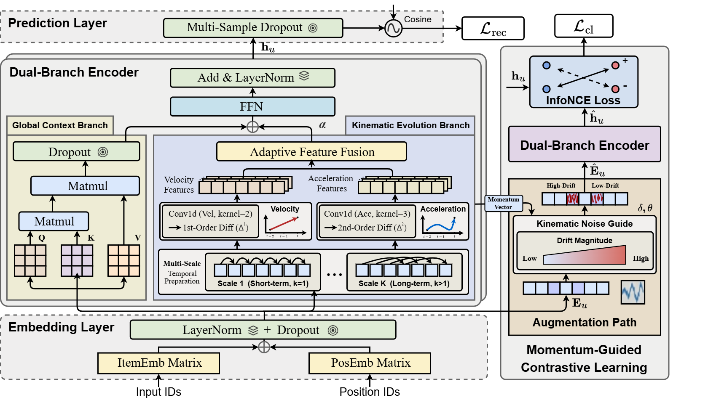

# KERec

This is our Pytorch implementation for the paper: "**Coupling Global Context with Kinematic Evolution for Sequential Recommendation**".
## Environment  Requirement

* Python 3.9  
* Pytorch 2.4.1
* numpy 1.26.4

Our code has been tested running under a Linux desktop with NVIDIA Tesla V100 GPUs.

## Model Overview



## Evaluate Model

We provide the trained models on Beauty, Sports_and_Outdoors, Toys_and_Games, Yelp and LastFM datasets in `./src/output/<Data_name>`folder. You can directly evaluate the trained models on test set by running:

```
python main.py --data_name <Data_name> --num_samples <Num_samples> --do_eval
```

On Beauty:

```python
python main.py --data_name Beauty --num_samples 5 --do_eval
```

```
{'Epoch': 0, 'HIT@5': '0.0745', 'NDCG@5': '0.0525', 'HIT@10': '0.1050', 'NDCG@10': '0.0623', 'HIT@20': '0.1455', 'NDCG@20': '0.0725'}
```

On Sports_and_Outdoors:

```python
python main.py --data_name Sports_and_Outdoors --num_samples 5 --do_eval
```

```
{'Epoch': 0, 'HIT@5': '0.0442', 'NDCG@5': '0.0304', 'HIT@10': '0.0643', 'NDCG@10': '0.0369', 'HIT@20': '0.0916', 'NDCG@20': '0.0438'}
```

On Toys_and_Games:

```python
python main.py --data_name Toys_and_Games --num_samples 5 --do_eval
```

```
{'Epoch': 0, 'HIT@5': '0.0845', 'NDCG@5': '0.0602', 'HIT@10': '0.1154', 'NDCG@10': '0.0701', 'HIT@20': '0.1506', 'NDCG@20': '0.0790'}
```

On Yelp:

```python
python main.py --data_name Yelp --num_samples 1 --do_eval
```

```
{'Epoch': 0, 'HIT@5': '0.0324', 'NDCG@5': '0.0205', 'HIT@10': '0.0534', 'NDCG@10': '0.0272', 'HIT@20': '0.0853', 'NDCG@20': '0.0352'}

```

On LastFM:

```python
python main.py --data_name LastFM --num_samples 5 --do_eval
```

```
{'Epoch': 0, 'HIT@5': '0.0624', 'NDCG@5': '0.0413', 'HIT@10': '0.0899', 'NDCG@10': '0.0501', 'HIT@20': '0.1376', 'NDCG@20': '0.0620'}
```


## Train Model

Please train the model using the Python script `main.py`.

You can run the following command to train the model on Beauty datasets:

```
python main.py --data_name Beauty --num_samples 5 --scales 1,3,5 --cl_weight 0.3 --noise_scale 0.2
```

or

You can use the training scripts in the `./src/scrips` folder to train the model 
```angular2html
bash beauty.sh
bash sports.sh
bash toys.sh
bash yelp.sh
bash lastfm.sh
```

## Acknowledgment

- Transformer and training pipeline are implemented based on [ICSRec](https://github.com/QinHsiu/ICSRec). Thanks them for providing efficient implementation.